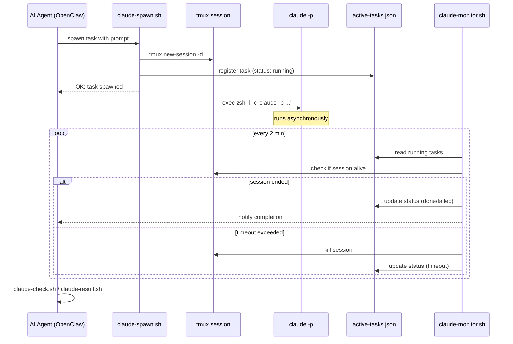
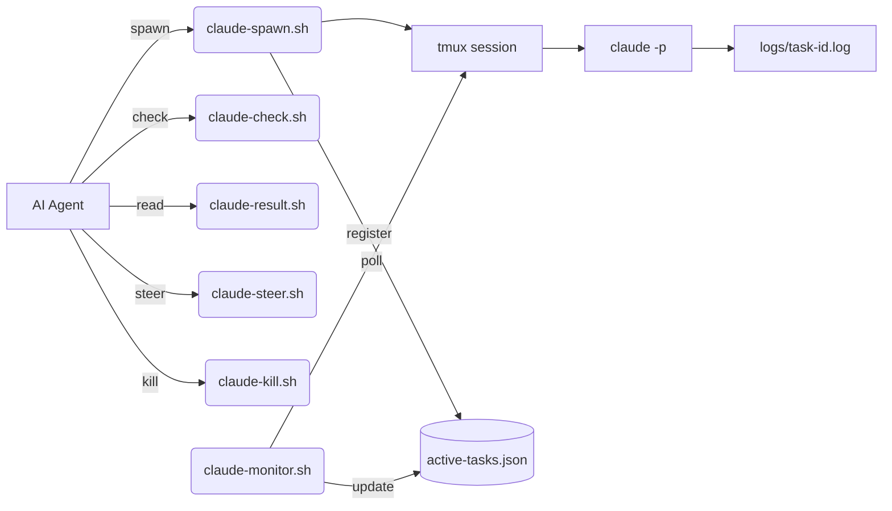

# claude-task-runner

A lightweight toolkit that lets AI agents (like [OpenClaw](https://github.com/nicepkg/openclaw)) asynchronously dispatch and manage [Claude Code](https://docs.anthropic.com/en/docs/claude-code) tasks via **tmux + shell scripts** — bypassing ACP protocol blocking issues.

## Why?

When an AI orchestrator calls Claude Code synchronously through ACP, it blocks the entire agent loop until the response returns. For long-running tasks, this is a dealbreaker. **claude-task-runner** solves this by spawning each Claude Code invocation in its own tmux session, with a task registry, monitoring, and result retrieval — all through simple shell scripts.

## Features

- **Async task spawning** — each task runs in an isolated tmux session
- **Task registry** — JSON-based tracking of all active, completed, and failed tasks
- **Auto-timeout** — configurable per-task timeout with automatic cleanup
- **Live inspection** — peek at running task output via `tmux capture-pane`
- **Mid-flight steering** — send follow-up messages to running tasks
- **Monitor daemon** — poll-based monitor updates registry and sends notifications on completion
- **Zero dependencies** — just `bash`, `tmux`, and `jq`

## Prerequisites

- **macOS** or **Linux**
- `tmux` >= 3.0
- `jq` >= 1.6
- `claude` CLI installed and authenticated ([docs](https://docs.anthropic.com/en/docs/claude-code))

```bash
# macOS
brew install tmux jq

# Ubuntu/Debian
sudo apt install tmux jq
```

## Quick Start

```bash
# 1. Clone the repo
git clone https://github.com/yourname/claude-task-runner.git
cd claude-task-runner

# 2. Initialize the task registry
echo '[]' > active-tasks.json
mkdir -p logs

# 3. Make scripts executable
chmod +x claude-*.sh

# 4. Spawn a task
./claude-spawn.sh my-task "Refactor the auth module to use JWT"

# 5. Check status
./claude-check.sh

# 6. Get the result when done
./claude-result.sh my-task
```

## How It Works





## Script Reference

### `claude-spawn.sh`

Spawns a new Claude Code task in a detached tmux session.

```
Usage: claude-spawn.sh <task-id> "<prompt>" [workdir] [timeout-seconds]
```

| Param | Default | Description |
|-------|---------|-------------|
| `task-id` | *(required)* | Unique identifier for the task |
| `prompt` | *(required)* | The prompt to send to Claude Code |
| `workdir` | `~/.openclaw/workspace` | Working directory for the task |
| `timeout` | `600` (10 min) | Max runtime in seconds before auto-kill |

### `claude-check.sh`

Checks the status of tasks.

```
Usage: claude-check.sh [task-id]
```

- **No args**: lists all tasks from the registry + live tmux sessions
- **With task-id**: shows detailed status including last 10 lines of output

### `claude-result.sh`

Retrieves the full output of a completed task from its log file.

```
Usage: claude-result.sh <task-id>
```

If the task is still running and no log exists yet, captures current tmux pane content as a fallback.

### `claude-kill.sh`

Terminates a running task and updates the registry.

```
Usage: claude-kill.sh <task-id>
```

### `claude-steer.sh`

Sends a follow-up message to a running Claude Code session (mid-flight correction).

```
Usage: claude-steer.sh <task-id> "<message>"
```

> **Note:** This sends keystrokes to the tmux session. It works when Claude Code is waiting for input but has no effect if `claude -p` has already completed.

### `claude-monitor.sh`

Polls all running tasks and updates the registry on completion, failure, or timeout. Designed to run on a cron schedule.

```
Usage: claude-monitor.sh
```

```bash
# Recommended: run every 2 minutes
*/2 * * * * /path/to/claude-monitor.sh
```

### `active-tasks.json`

The task registry. A JSON array where each entry tracks:

```json
{
  "id": "my-task",
  "tmuxSession": "claude-my-task",
  "prompt": "...",
  "workdir": "/path/to/workspace",
  "log": "/path/to/logs/my-task.log",
  "startedAt": 1700000000000,
  "status": "running",
  "timeout": 600
}
```

Status values: `running` | `done` | `failed` | `timeout` | `killed` | `no-log`

## Troubleshooting

### `claude: command not found` inside tmux

tmux starts a non-login shell by default, so your PATH may not include the directory where `claude` is installed.

**Fix:** Use a login shell when spawning:

```bash
tmux new-session -d -s mysession "exec zsh -l -c 'claude -p \"your prompt\"; exit'"
```

The key is `exec zsh -l -c` — the `-l` flag loads your full shell profile.

---

### tmux session stays open after Claude finishes

If you run `claude -p "..."` without appending `; exit`, the shell inside tmux remains alive after Claude exits, making it look like the task is still running.

**Fix:** Always chain `; exit` after the claude command:

```bash
"exec zsh -l -c 'claude -p \"prompt\" > output.log 2>&1; exit'"
```

---

### Claude takes 20-30 seconds to respond initially

The first invocation of `claude -p` may appear to hang for 20-30 seconds. This is **not** a bug — it's API proxy warmup / connection negotiation latency.

**Fix:** Don't set timeouts below 60 seconds. The default 600s is a safe starting point.

---

### `timeout: command not found` on macOS

macOS does not ship with GNU `timeout`. If your scripts need it:

**Option A — Use Perl (no install needed):**

```bash
perl -e 'alarm shift; exec @ARGV' 60 claude -p "your prompt"
```

**Option B — Install GNU coreutils:**

```bash
brew install coreutils
# Use gtimeout instead of timeout
gtimeout 60 claude -p "your prompt"
```

---

### Quotes in prompts get mangled

Passing prompts with quotes through multiple layers of shell expansion (agent → bash → tmux → zsh) is error-prone.

**Fix:** Use single quotes for the outer tmux command and escape inner quotes carefully:

```bash
# Correct
tmux new-session -d -s task \
  "exec zsh -l -c 'claude -p \"Refactor the auth module\" > log 2>&1; exit'"

# Also works: use a temp file for complex prompts
echo 'Your complex "prompt" with special chars' > /tmp/prompt.txt
tmux new-session -d -s task \
  "exec zsh -l -c 'claude -p \"\$(cat /tmp/prompt.txt)\" > log 2>&1; exit'"
```

## License

[MIT](LICENSE)

---

Built for the [OpenClaw](https://github.com/nicepkg/openclaw) ecosystem. Works with any AI agent that can execute shell commands.
